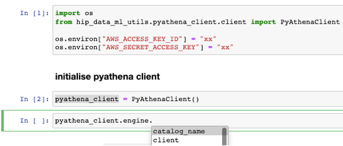
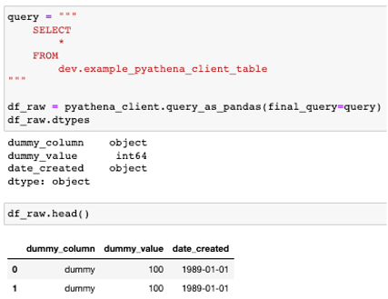

[](https://backyard.k8s.hipages.com.au/catalog/default/Component/data-ml-utils)
[](https://backyard.k8s.hipages.com.au/catalog/default/Component/data-ml-utils)
# data-ml-utils
A utility python package that covers the common libraries we use

## Installation
This is an open source library hosted on pypi. Run the following command to install the library.
```
pip install hip-data-ml-utils --upgrade
```

## Documentation
Head over to https://hip-data-ml-utils.readthedocs.io/en/latest/index.html# to read our library documentation

## Feature
### Pyathena client initialisation
Almost one liner
```python
import os
from hip_data_ml_utils.pyathena_client.client import PyAthenaClient

os.environ["AWS_ACCESS_KEY_ID"] = "xxx"
os.environ["AWS_SECRET_ACCESS_KEY"] = "xxx" # pragma: allowlist secret
os.environ["S3_BUCKET"] = "xxx"

pyathena_client = PyAthenaClient()
```


### Pyathena query
Almost one liner
```python
query = """
    SELECT
        *
    FROM
        dev.example_pyathena_client_table
    LIMIT 10
"""

df_raw = pyathena_client.query_as_pandas(final_query=query)
```


### MLflow utils
Visit [link](https://data-ml-utils.readthedocs.io/en/latest/index.html#mlflow-utils)

### More to Come
* You suggest, raise a feature request issue and we will review!

## Tutorials
### Pyathena
There is a jupyter notebook to show how to use the package utility package for `pyathena`: [notebook](tutorials/[TUTO]%20pyathena.ipynb)

### MLflow utils
There is a jupyter notebook to show how to use the package utility package for `mlflow_databricks`: [notebook](tutorials/[TUTO]%20mlflow_databricks.ipynb)
