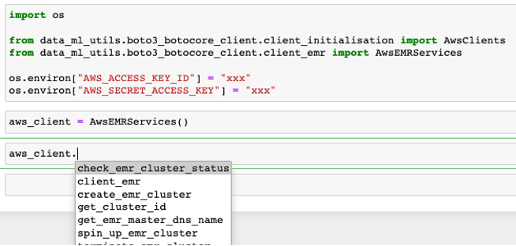
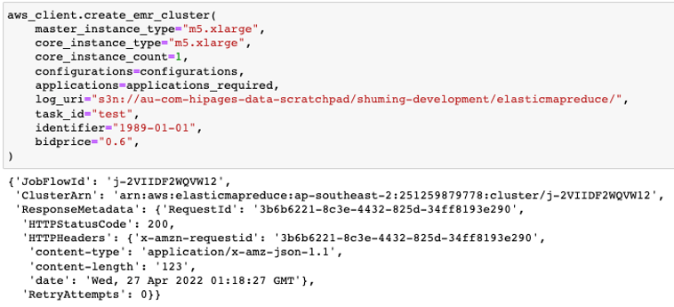
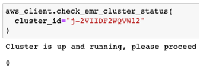
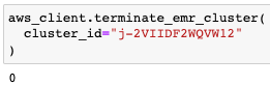
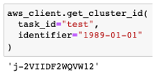
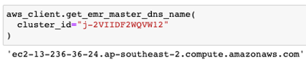
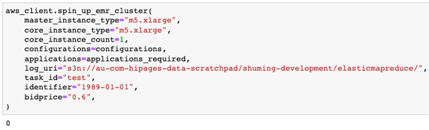

Client boto3 and botocore (EMR)
===============================

The EMR client class initialises botocore EMR client. It has methods that creates an EMR cluster, check status and terminate cluster.

Environment variables
---------------------

Before initialising the EMR client, we will need to define two environment variables; `AWS_ACCESS_KEY_ID`, `AWS_SECRET_ACCESS_KEY`

This can be the `gandalf_dev_aws_keypair` from KeyBase or your own AWS creds from `~/.aws/credentials`

Defining the environment variables can be done through `cli` or in your `.ipynb`

`cli`

.. code-block:: console

   $ export AWS_ACCESS_KEY_ID=xxx
   $ export AWS_SECRET_ACCESS_KEY=xxx

`.ipynb`

.. code-block:: python

   import os
   os.environ["AWS_ACCESS_KEY_ID"] = "xxx"
   os.environ["AWS_SECRET_ACCESS_KEY"] = "xxx"

Initialising EMR client
-----------------------------
We will need to import the python package

.. code-block:: python

   from data_ml_utils.boto3_botocore_client.client_emr import AwsEMRServices

And then initialise the class

.. code-block:: python

   aws_client = AwsEMRServices()

You can now access the EMR client with `aws_client.`

The initialisation of this class would have the EMR and boto3 session accessible too.

Create EMR cluster
------------------
This function creates an EMR cluster.

A successful response return the API response, and raises an exception otherwise

.. code-block:: python

   aws_client.create_emr_cluster(
      master_instance_type="ml.m5.xlarge",
      core_instance_type="m5.xlarge",
      core_instance_count=1,
      configurations=configurations,
      applications=applications,
      log_uri="s3n://au-com-hipages-data-scratchpad/shuming-development/elasticmapreduce/",
      task_id="test",
      identifier="1989-01-01",
      bidprice="0.6",
   )

Example of configuration: `config <https://github.com/hipagesgroup/hipages-offline-feature-store/blob/master/src/settings.py#L76>`_
Example of application: `application <https://github.com/hipagesgroup/hipages-offline-feature-store/blob/master/src/settings.py#L127>`_

Check EMR cluster status
------------------------
This function checks the status of the created EMR cluster. It waits for the cluster to be in `WAITING` status.

A successful response return `0`, and raises an exception otherwise

.. code-block:: python

   aws_client.check_emr_cluster_status(
      cluster_id="j-2VIIDF2WQVW12"
   )

Terminate EMR cluster status
----------------------------
This function terminates the created EMR cluster.

A successful response return `0`

.. code-block:: python

   aws_client.terminate_emr_cluster(
      cluster_id="j-2VIIDF2WQVW12"
   )

Get EMR cluster id
------------------
This function gets the EMR cluster id through task and identifier

A successful response return the cluster id

.. code-block:: python

   aws_client.get_cluster_id(
      task_id="test",
      identifier="1989-01-01"
   )

Get EMR cluster master dns name
-------------------------------
This function retrieves the EMR cluster master dns name

A successful response return the EMR cluster master dns name

.. code-block:: python

   aws_client.get_emr_master_dns_name(
      cluster_id="j-2VIIDF2WQVW12"
   )

Wrapper function to spin up EMR cluster
---------------------------------------
This function is a wrapper function that spins up an EMR cluster and uses the check EMR cluster and get master dns name methods

A successful response return `0`, and raises an exception otherwise

.. code-block:: python

   aws_client.spin_up_emr_cluster(
      master_instance_type="ml.m5.xlarge",
      core_instance_type="m5.xlarge",
      core_instance_count=1,
      configurations=configurations,
      applications=applications,
      log_uri="s3n://au-com-hipages-data-scratchpad/shuming-development/elasticmapreduce/",
      task_id="test",
      identifier="1989-01-01",
      bidprice="0.6",
   )

