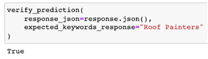
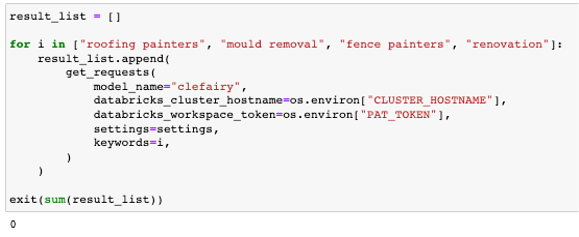

MLflow prediction requests
==========================

This MLflow prediction requests will be used when we run our integration tests after a model endpoint is deployed. This is to ensure the deployed model works as expected. This would only work in databricks ML runtime cluster.

ML runtime cluster
------------------

Please only use `11.3` ML runtime cluster, our MLflow version is tied to `1.29.0`, which is 11.3 cluster version.

.. image:: ../_static/mlflow_databricks_runtime_version.png
   :align: center

Verify prediction
-----------------
This function verifies if a prediction output is as expected

A successful response will return a True boolean, and False boolean otherwise

.. code-block:: python

   verify_prediction(
       response_json=response.json(),
       expected_keywords_response="Roof Painters"
   )

Get requests
------------
This function makes post requests for model inference and verify that inference is within expectations

A successful response will return a non zero exit function if successful

.. code-block:: python

   result_list = []

   for i in ["roofing painters", "mould removal", "fence painters", "renovation"]:
       result_list.append(
           get_requests(
               model_name="clefairy",
               databricks_cluster_hostname=os.environ["CLUSTER_HOSTNAME"],
               databricks_workspace_token=os.environ["PAT_TOKEN"],
               settings=settings,
               keywords=i,
           )
       )

   exit(sum(result_list))

