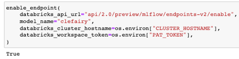
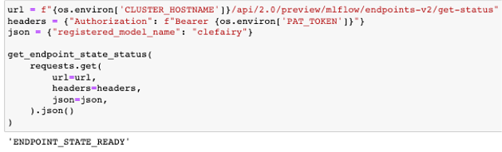
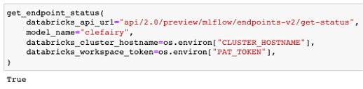
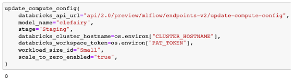

MLflow serve
============

This MLflow serve will be used when we want to enable a registered model databricks endpoint. This would only work in databricks ML runtime cluster.

ML runtime cluster
------------------

Please only use `11.3` ML runtime cluster, our MLflow version is tied to `1.29.0`, which is 11.3 cluster version.

.. image:: ../_static/mlflow_databricks_runtime_version.png
   :align: center

Enable model endpoint
---------------------
This enable databricks model endpoint of a registered model (any model in Staging or Production tag gets deployed)

A successful response will return a True boolean, and raises an exception otherwise

.. code-block:: python

   enable_endpoint(
       databricks_api_url="api/2.0/preview/mlflow/endpoints-v2/enable",
       model_name="clefairy",
       databricks_cluster_hostname=os.environ["CLUSTER_HOSTNAME"],
       databricks_workspace_token=os.environ["PAT_TOKEN"],
   )

Get endpoint state status
-------------------------
This function returns the state of the databricks model endpoint, example: READY.

A successful response will return a READY string, and raises an exception of NOT_READY otherwise

.. code-block:: python

   url = f"{os.environ['CLUSTER_HOSTNAME']}/api/2.0/preview/mlflow/endpoints-v2/get-status"
   headers = {"Authorization": f"Bearer {os.environ['PAT_TOKEN']}"}
   json = {"registered_model_name": "clefairy"}

   get_endpoint_state_status(
       requests.get(
           url=url,
           headers=headers,
           json=json,
       ).json()
   )

Get endpoint status
-------------------
This function returns a boolean if databricks model endpoint status is ready

A successful response will return a True boolean, and raises an exception otherwise

.. code-block:: python

   get_endpoint_status(
       databricks_api_url="api/2.0/preview/mlflow/endpoints-v2/get-status",
       model_name="clefairy",
       databricks_cluster_hostname=os.environ["CLUSTER_HOSTNAME"],
       databricks_workspace_token=os.environ["PAT_TOKEN"],
   )

Update compute config
---------------------
This function update the databricks endpoint compute config of a registered model; cluster size and if it scales to zero

A successful response will return a non zero exit function if successful

.. code-block:: python

   update_compute_config(
       databricks_api_url="api/2.0/preview/mlflow/endpoints-v2/update-compute-config",
       model_name="clefairy",
       stage="Staging",
       databricks_cluster_hostname=os.environ["CLUSTER_HOSTNAME"],
       databricks_workspace_token=os.environ["PAT_TOKEN"],
       workload_size_id="Small",
       scale_to_zero_enabled="true",
   )

