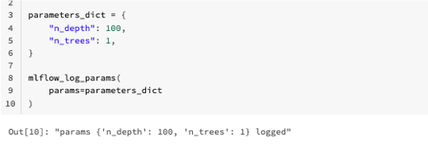

MLflow tracker utils
====================

This MLflow tracker utils will be used when we run our workflow jobs in databricks. This would only work in databricks ML runtime cluster.

ML runtime cluster
------------------

Please only use `11.3` ML runtime cluster, our MLflow version is tied to `1.29.0`, which is 11.3 cluster version.

MLflow log artifact
-------------------
We will need to import the python package

.. code-block:: python

   from data_ml_utils.mlflow_databricks.mlflow_tracker import mlflow_log_artifact

And then call the function, when we have an artifact to log.

.. code-block:: python

   mlflow_log_artifact(artifact=test_object, artifact_name="test_file", artifact_path="test_directory")

We are showing the difference between having `artifact_path` and not.

.. image:: ../_static/mlflow_log_artifact.png
   :align: center

MLflow log and register model
-----------------------------
This function logs and register a model.

A successful response will see a model being logged in the run artifacts, and raises an exception otherwise

.. code-block:: python

   mlflow_log_register_model(
      model=model,
      type_of_model="sk_model",
      model_func_dict=model_function_dict,
      artifact_path="test_directory_2",
      name_of_registered_model="dp-handyman-small-sized",
   )

The `type_of_model` can be chosen from the dictionary keys.

MLlflow log params
------------------
This function logs the model parameters.

A successful response will return a string response to indicate the parameter is logged, and raises an exception otherwise

.. code-block:: python

   mlflow_log_params(
      params=parameters_dict
   )

MLlflow log evaluation metrics
------------------------------
This function logs the evaluation metrics

A successful response will return a string response to indicate the metric is logged, and raises an exception otherwise

.. code-block:: python

   mlflow_log_metric(
      key="accuracy",
      value=1.0
   )

.. image:: ../_static/mlflow_log_metric.png
   :align: center
