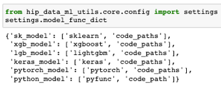
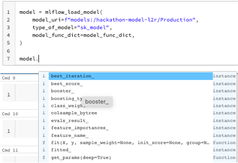
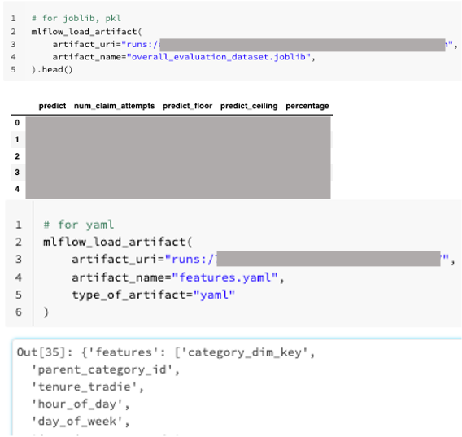
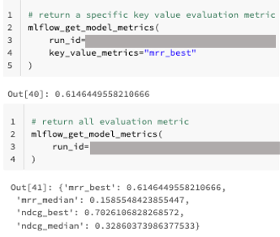
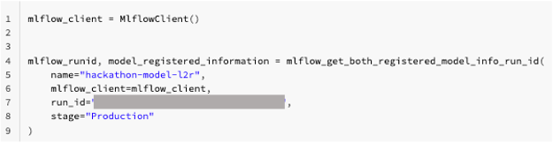
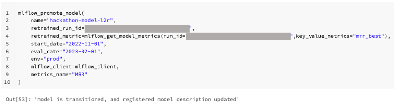

MLflow utils
============

This MLflow utils will be used when we run our workflow jobs in databricks. This would only work in databricks ML runtime cluster.

ML runtime cluster
------------------

Please only use `11.3` ML runtime cluster, our MLflow version is tied to `1.29.0`, which is 11.3 cluster version.

.. image:: ../_static/mlflow_databricks_runtime_version.png
   :align: center

MLflow load model
-----------------
This loads an ML model from a list of allowed model types.

.. code-block:: python

   from hip_data_ml_utils.core.config import settings
   settings.model_func_dict

Here is how we call the load model function. A successful response will load the model, and raises an exception otherwise

.. code-block:: python

   model = mlflow_load_model(
       model_uri=f"models:/hackathon-model-l2r/Production",
       type_of_model="sk_model",
       model_func_dict=settings.model_func_dict,
   )

When we have loaded the model, we can just invoke the functions from the type of model.

MLflow load artifact
--------------------
This function load an artifact in an MLflow run.

A successful response will return the artifact, and raises an exception otherwise

.. code-block:: python

   # for joblib, pkl, dict
   mlflow_load_artifact(
       artifact_uri="runs:/xxx/yyy",
       artifact_name="overall_evaluation_dataset.joblib",
   ).head()

   # for yaml
   mlflow_load_artifact(
       artifact_uri="runs:/zzz",
       artifact_name="features.yaml",
       type_of_artifact="yaml"
   )

At the moment, we allow for a few types of loading of artifacts; `pkl`, `joblib`, `dict` and `yaml`

MLlflow retrieve model evaluation metrics
-----------------------------------------
This function retrieves (all of) the model evaluation metrics or just a singular key value

A successful response will return all of the evaluation metrics if no key is specified, or a specific key value metric.

.. code-block:: python

   # return a specific key value evaluation metric
   mlflow_get_model_metrics(
       run_id="xx",
       key_value_metrics="mrr_best"
   )
   # return all evaluation metric
   mlflow_get_model_metrics(
       run_id="xx",
   )

MLlflow retrieve registered run info and run_id
-----------------------------------------------
This function returns the registered model information from the specified MLflow run_id.
And also returns the MLflow run_id of the specified staging tag; Staging, Archived or Production

A successful response will return both specified stage tag of its MLflow run_id, and specified MLflow run_id of its registered model information

.. code-block:: python

   mlflow_client = MlflowClient()

   mlflow_runid, model_registered_information = mlflow_get_both_registered_model_info_run_id(
       name="hackathon-model-l2r",
       mlflow_client=mlflow_client,
       run_id="xx",
       stage="Production"
   )

MLlflow promote model
---------------------
This function decides if we need to promote model to the staging tag if there is no model in the specified staging tag, and

A successful response will return a string response to

.. code-block:: python

   mlflow_client = MlflowClient()

   mlflow_promote_model(
       name="hackathon-model-l2r",
       retrained_run_id="xx",
       retrained_metric=mlflow_get_model_metrics(run_id="xx",key_value_metrics="mrr_best"),
       start_date="2022-11-01",
       eval_date="2023-02-01",
       env="prod",
       mlflow_client=mlflow_client,
       metrics_name="MRR"
   )

